  
  
  

## 🚀 Featured Projects

  

### ⚠️ Disclaimer
All security-related projects here are for <b>education & testing on your own devices/networks only</b>. 
Using them against networks or devices without permission is illegal. I'm not responsible for misuse.

  

